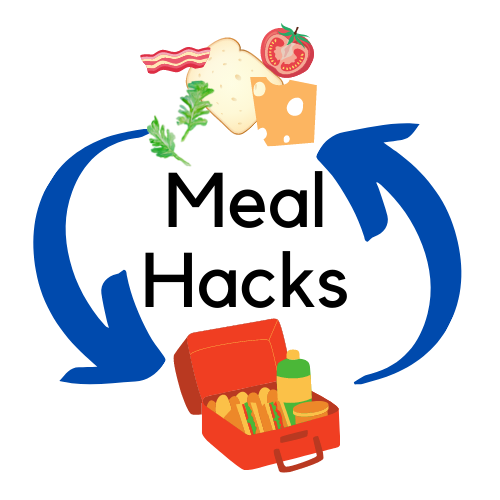
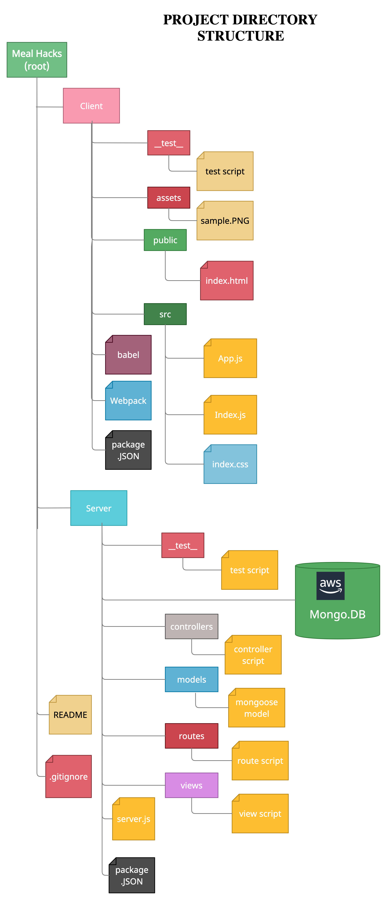
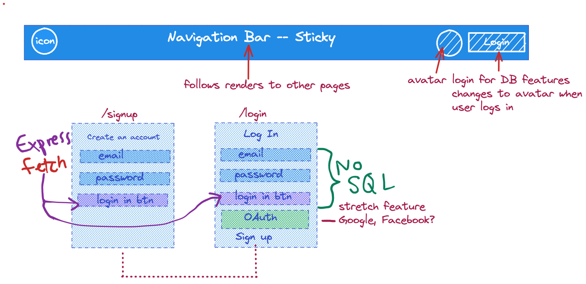
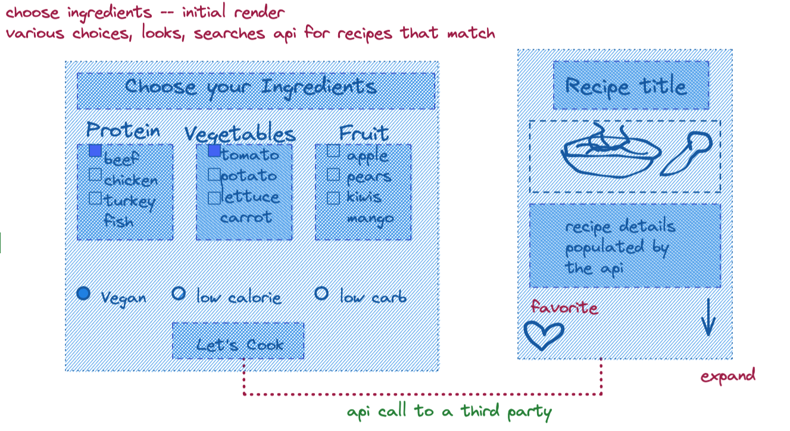

# meal-hacks
A web application to input ingredients and receive recipes.  Will store favorites and get rid of disliked recipes.
#Meal Hacks

    

<h1 align ="center">Meal Hacks</h1>

A source for families to plug in what is in their pantry and load easy to follow recipes.

<h2 align="center">Table of Contents</h2>

* [FolderStructure](https://github.com/esaldivar/meal-hacks/#FolderStructure)
* [Wireframe](https://github.com/esaldivar/meal-hacks/#Wireframe)
* [Features](https://github.com/esaldivar/meal-hacks/#Features)
* [License](https://github.com/esaldivar/meal-hacks/#License)

<h2 href="#FolderStructure" align="center" >File System Folder Structure</h2>

I used <a href="https://creately.com/" target="_blank">Creatly</a> to create my folder structure.  I am linking it here to display my thought process for this SPA.

<h2 href="#Wireframe" align="center" >Wireframe</h2>

I used <a href="https://excalidraw.com/" target="_blank">Excalidraw</a> to create a wireframe.  I am linking it here to display my thought process for this SPA.

<h2 href="#Features">Features</h2>
<h2 href="#License">License</h2>

This product is licensed under the MIT License - see the LICENSE.md file for details.

<h3 align="left">Languages and Tools:</h3>

 
        </a>  
  

